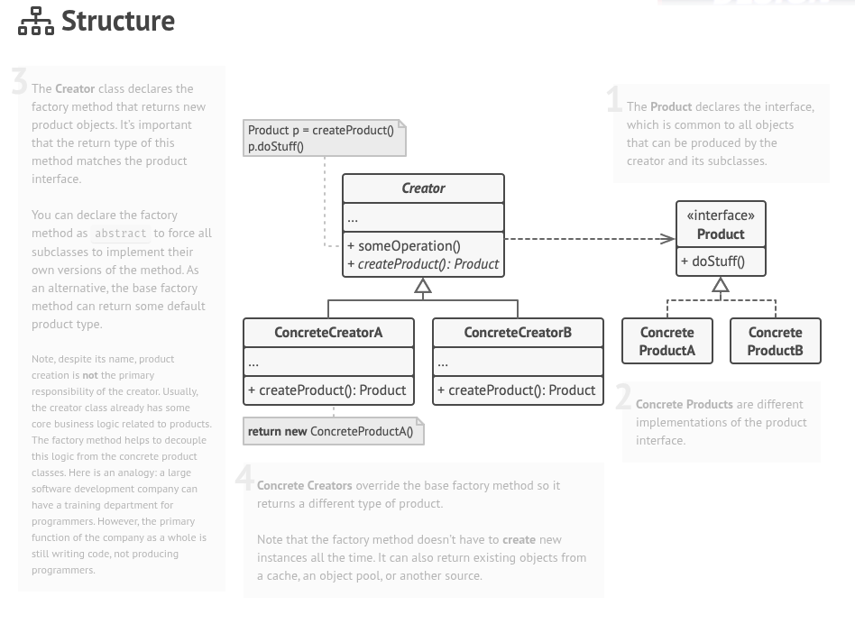

# Document Creator - Factory Method Pattern

This project demonstrates the Factory Method design pattern in Java by creating different types of documents (PDF, Word, Excel) through dedicated creator classes.

## Diagram



## How it works
- `Document` is the product interface implemented by concrete products: `PdfDocument`, `WordDocument`, and `ExcelDocument`.
- `DocumentCreator` is the creator/abstract factory with a factory method implemented by concrete creators: `PdfCreator`, `WordCreator`, and `ExcelCreator`.
- `Main` uses the creators to instantiate the appropriate document types without coupling to concrete classes.

## Run
This is a Maven project. To run:

```bash
mvn -q -DskipTests package
java -cp target/document-creator-factory-method-1.0-SNAPSHOT.jar org.example.Main
```

## Project structure
- `src/main/java/org/example/product` — product hierarchy (documents)
- `src/main/java/org/example/creator` — creators with the factory method
- `factory-method-pattern.png` — diagram embedded above
